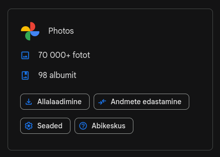
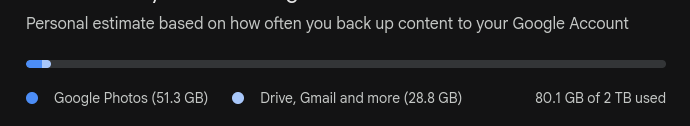

It's been about a year and a half since I posted my [first defaults list](/blog/2024/07/app-defaults-2024), which was inspired by [Robb Knight's App Defaults](https://defaults.rknight.me/). Enough has changed since then and I think it's about time I do a proper update now. The changes are mostly toward less cloud, more control and more open source. I moved off Windows entirely, switched my phone to LineageOS, started self-hosting more things, and thought about privacy a lot more. Hence, there were a lot of changes in my daily apps.

Okay, let's start:

| Category | 2024 | 2026 | Comments |
| --- | --- | --- | --- |
| 📨 Mail Client | Spark | Thunderbird (domain), Spark | Thunderbird handles my domain setup well enough |
| 📮 Mail Server | Zoho Mail | Self-hosted + Zoho, Proton Mail, Tuta | Zoho stays as a fallback, Proton and Tuta for anything sensitive |
| 📝 Notes | Notesnook, Nextcloud Notes | [Notesnook](https://notesnook.com/) | Notesnook does everything I need |
| ✅ To-Do | Workflowy, Nextcloud Deck | Notesnook | |
| 📷 Photo Shooting | Stock Samsung camera | [BigKaka's AGC Google Camera build](https://www.celsoazevedo.com/files/android/google-camera/dev-BigKaka/f/dl80/) | Switched phones, GCam takes noticeably better photos |
| 🟦 Photo Management | Nextcloud Photos, Google Photos | Google Photos | I can't move 70k images away to anywhere but my local storage... |
| 📆 Calendar | Google Calendar | Google Calendar | |
| 📁 Cloud Storage | Nextcloud (self-hosted) | - | I now use Tailscale to fetch files from my server instead |
| 📖 RSS | Fluent Reader | [Newsflash](https://apps.gnome.org/Newsflash/) (desktop), [Feeder](https://github.com/spacecowboy/Feeder/) (mobile) | Fluent Reader is barely maintained now |
| 🙍 Contacts | Google Contacts | Google Contacts | |
| 🌐 Browser | Firefox, Brave | Firefox (main), [Vivaldi](https://vivaldi.com/) (work), Brave (dev) | |
| 🔎 Search | *new* | [Kagi](https://kagi.com/) (main), [Brave Search](https://search.brave.com/), [DuckDuckGo](https://duckduckgo.com/) | In 2024 I was using DuckDuckGo only, now Kagi is worth the money |
| 💬 Chat | Discord, Zalo, Messenger, Telegram | [Signal](https://signal.org/), [Matrix](https://matrix.org/), [Olvid](https://olvid.io/), Discord, Telegram, [Zalo](https://zalo.me/) | Private communications moved to Signal, Matrix and Olvid |
| 🔀 Matrix Client | *new* | [FluffyChat](https://fluffychat.im/) (desktop), [SchildiNext](https://schildi.chat/next/) (mobile) | Migrating desktop to [SchildiChat Revenge](https://schildi.chat/revenge/) once it's ready |
| 🔖 Bookmarks | Browser manager | Browser manager | |
| 📑 Read It Later | Notesnook | Notesnook | |
| 📜 Word Processing | LibreOffice, Google Docs | LibreOffice (personal), Google Docs (work) | |
| 📈 Spreadsheets | Google Sheets | LibreOffice (personal), Google Sheets (work) | |
| 📊 Presentations | PowerPoint, Canva | LibreOffice (personal), Canva (uni) | Dropped PowerPoint, off Windows now |
| 🛒 Shopping Lists | Notesnook | Notesnook | |
| 🍴 Meal Planning | Nextcloud Cookbook | Notesnook, meal forums | Meal forums are actually good |
| 💰 Budgeting | Money Lover, Google Sheets | [Money Lover](https://moneylover.me/) | |
| 📰 News Aggregators | Google News, Zalo | RSS list, Zalo | No algorithmic nonsense, thank you very much |
| 🎵 Music | YouTube Music | YouTube Music | |
| 🎤 Podcasts | YouTube Music | [Podcasts](https://apps.gnome.org/Podcasts/) (desktop), [AntennaPod](https://antennapod.org/) (mobile) | YouTube's podcast user experience is just weird |
| 🔐 Passwords | Bitwarden (self-hosted) | Vaultwarden (self-hosted) | Same thing, just switched to a Rust rewrite |
| 🔑 2FA | *new* | YubiKey + Bitwarden Authenticator | |
| 🔒 VPN | *new* | [Mullvad](https://mullvad.net/) on top of [Tailscale](https://tailscale.com/) | |
| 🚫 Ad Blocking | *new* | [uBlock Origin](https://ublockorigin.com/) + [Mullvad DNS](https://mullvad.net/en/help/dns-over-https-and-dns-over-tls) | |
| 📱 Launcher | Niagara Launcher | [Niagara Launcher](https://niagaralauncher.app/) | |
| 🌌 Screenshot | ShareX, GNOME Screenshot | GNOME Screenshot | Off Windows, so ShareX is gone |
| 📋 Clipboard | Clipboard Indicator | [Clipboard Indicator](https://extensions.gnome.org/extension/779/clipboard-indicator/) | |
| 📺 Media Player | *new* | [Cine](https://github.com/diegopvlk/Cine) | |
| 📚 Reading | *new* | [Foliate](https://johnfactotum.github.io/foliate/) (ebooks), [Komikku](https://apps.gnome.org/Komikku/) (manga) | |
| 🎨 Image Editor | *new* | [GIMP](https://www.gimp.org/), [Inkscape](https://inkscape.org/) | |
| 🎬 Video Editor | *new* | [Kdenlive](https://kdenlive.org/) | |
| 📄 PDF Editor | *new* | [PDF Arranger](https://github.com/pdfarranger/pdfarranger) | |
| 🗺️ Navigation | *new* | [Organic Maps](https://organicmaps.app/) (offline), [Waze](https://www.waze.com/) (driving) | |
| ✍️ Blogging | *new* | [Astro](https://astro.build/) | |
| 💻 Terminal | *new* | [Ptyxis](https://apps.gnome.org/Ptyxis/) | |
| ⌨️ Code Editor | *new* | [Zed](https://zed.dev/) (main), VSCode | Zed's AI features are [turned off](https://www.neowin.net/news/its-now-possible-to-disable-all-ai-features-in-zed-editor/) |
| 🖥️ OS | *new* | [Fedora](https://fedoraproject.org/) (desktop), [LineageOS](https://www.lineageos.org/) (mobile) | In 2024 I was dual-booting Fedora and Windows on desktop |

## Breakdown

The biggest shift was in my chat apps. Discord and Messenger are out for anything private, and replacing those were Signal, Matrix and Olvid. I still have Discord and Telegram because some communities don't care about this as much as I do, and Zalo stays because it's basically infrastructure in Vietnam at this point, no escaping that one. On the Matrix clients side I'm currently on FluffyChat on desktop and SchildiNext on Android, but I'm waiting on SchildiChat Revenge to mature so I can switch to that.

On the Google side, I kept Photos and Calendar. They just work well enough that the tradeoff isn't worth it, and Google Photos in particular is impossible to leave, as I have more than 70k photos in there. Yeah, 70k! Look at this!

Safe to say I'm locked in for good lmao.

Moving away from YouTube for podcasts was loooong overdue, the experience there is really weird and I'm not sure who it's designed for or why I even bothered to use it in the first place. AntennaPod and GNOME Podcasts are both better at being podcast apps, unsurprisingly.

The rest of the changes are smaller. Notesnook absorbed most of what used to be split across Nextcloud Notes, Workflowy and Nextcloud Deck, as I just stopped needing the separation. Fluent Reader got dropped because [it's barely maintained](https://github.com/yang991178/fluent-reader/commits/master/) at this point. Kagi replaced DuckDuckGo as my main search engine and it's really worth paying for. And I switched from upstream Bitwarden to Vaultwarden, a compatible reimplementation in Rust, mostly to give my server a lighter load.

That's it for me!

Also, this is my first post of the [#100DaysToOffload](https://100daystooffload.com/) challenge.
