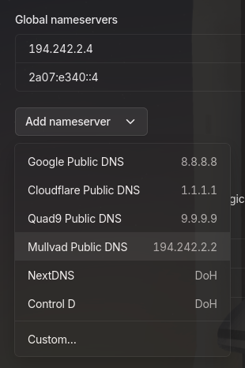

I recently had to do a clean reinstall of Fedora, it was just about time anyway because my system config drifts far enough from what I remember that reinstalling is faster. The upside was that I had to redo everything from scratch, which forced me to actually document it this time. I'd already updated my app defaults post after realizing how outdated the 2024 version had gotten, and so now it's time for the system itself.

This isn't a beginner's guide to Fedora setup, nor is it a hardening competition. It's just my setup, logged in the order I did it, with the reasoning behind the choices that weren't obvious. If you're running Fedora and care about having a reasonably tight system without going full on Qubes, this should be useful.

If however, you're new to Linux or Fedora, I recommend following [this installation guide](https://itsfoss.com/install-fedora/) first, then come back to this post later [down here](#now-lets-do-the-post-installation-security-setup) when you're ready for more advanced configurations.

This post will be looooooong, so buckle up :3

Here's a quick table of contents:

- [First things first, installation](#first-things-first-installation)
- [Post-installation security setup](#now-lets-do-the-post-installation-security-setup)
- [System audit](#lets-start-an-audit-of-the-system)
- [Other software](#finally-were-done-with-security-lets-get-other-things-done)

## First things first, installation

I use GNOME, so we'll start at [https://fedoraproject.org/workstation/download/](https://fedoraproject.org/workstation/download/) and grab the Workstation ISO. You can get the KDE version if you prefer. And of course, verify it to know it's actually from Fedora. Fedora's download page already has instructions to verify, I'm not gonna write it here again. If you see `Good signature from "Fedora...` on the first line and `OK` on the second, all good. If either fails, don't proceed and redownload the ISO.

Write it to a USB drive. I use `dd` personally, Fedora Media Writer works fine too if you prefer a GUI. Or balenaEtcher, Unetbootin, Rufus, the likes, whichever you prefer.

```bash
dd if=/path/to/Fedora-Workstation-Live.iso of=/dev/sdX bs=4M status=progress && sync
```

Replace /dev/sdX with your actual drive. Double-check with `lsblk` before running this. You know the drill.

> **Note**: I recommend against using Ventoy. See [this Reddit thread](https://redlib.catsarch.com/r/linux/comments/1buhnrs/is_ventoy_safe_in_light_of_xzliblzma_scare/), Ventoy issues [#2795](https://github.com/ventoy/Ventoy/issues/2795) and [#3224](https://github.com/ventoy/Ventoy/issues/3224), in summary Ventoy has blobs that no one can verify whether they're safe. Remember the `xz` issue? Yep. Also, a related project by the author [used to load a fake trusted CA certificate](https://github.com/ventoy/PXE/issues/106) without documentation.

Next, boot from the USB drive and get into the installer. Don't connect to the internet at this stage. Most of it is straightforward, but the one thing to pay attention to is storage configuration. Under "Installation destination", check "Encrypt my data" before anything else. This sets up LUKS2 full-disk encryption, and you'll be prompted to set a passphrase, make it strong. The installer will handle the rest.

Worth noting: `/boot` won't be encrypted, and that's fine. It's generally not recommended to encrypt it anyway, see [this RHEL article](https://access.redhat.com/solutions/3419031).

Once installation finishes, reboot into the main OS and remove the USB drive. We'll start from there.

## Now let's do the post-installation security setup

The first thing you'll see into boot is the welcome screen. You can just follow the prompts.

If you want to choose the UTC timezone, you'll have to select Reykjavik, Iceland or Troll, Antarctica as your city. Otherwise, just select your local city as normal.

### I don't need bloat

Now that you're into the main screen, Fedora Workstation ships with a handful of GNOME apps I don't use and don't want sitting around. Here's what I removed:

```bash
sudo dnf remove -y gnome-tour gnome-maps gnome-weather gnome-contacts gnome-clocks simple-scan mediawriter
```

Adjust this to whatever you actually don't use. Don't blindly nuke things, some of these pull in dependencies that other things rely on, so check first if you're unsure.

### And I don't want a weak crypto policy (not that kind of crypto)

Fedora uses a system-wide cryptographic policy that controls what algorithms and key sizes are acceptable across TLS, IPsec, SSH, DNSSec, and Kerberos. The default is `DEFAULT` (duh), which still allows SHA-1 in digital signatures and certificates. SHA-1 has been practically broken for years.

I set it to `DEFAULT:NO-SHA1`, which keeps the `DEFAULT` while prohibiting SHA-1:

```bash
sudo update-crypto-policies --set DEFAULT:NO-SHA1
```

If you want to go stricter, `FUTURE` is the next level up as it enforces stronger minimums across the board. However, `curl` and dnf updates WILL break. It's really not recommended unless your threat model requires strict security and you won't be connecting to the internet anyway. See [Fedora's changelog](https://fedoraproject.org/wiki/Changes/CryptoPolicy) and [Red Hat's documentation](https://docs.redhat.com/en/documentation/red_hat_enterprise_linux/8/html/security_hardening/using-the-system-wide-cryptographic-policies_security-hardening#system-wide-crypto-policies_using-the-system-wide-cryptographic-policies) for more details.

After that, verify what's active:

```bash
update-crypto-policies --show
```

The output should be `DEFAULT:NO-SHA1`.

### We can finally update the system now

Connect to the internet, update the system and reboot.

```bash
sudo dnf upgrade --refresh -y && sudo reboot
```

### How about less unused services?

Some services ship enabled by default that I have no use for. Let's nuke them into oblivion. You can always re-enable them later if you find you need them.

```bash
sudo systemctl disable --now cups.service
sudo systemctl disable --now avahi-daemon.service
sudo systemctl disable --now ModemManager.service
```

- CUPS is the service for printing.
- Avahi is the mDNS/DNS-SD daemon, it's what lets you do `.local` hostname discovery on a LAN. It's useful in some home networks, but I certainly don't need it.
- ModemManager is for managing mobile broadband (3G/4G/5G) connections, which I'm pretty sure most people won't ever need unless you're running a Linux phone or those SIM card USB modems.

If you need any of these, by all means keep them. But if you don't, it's best to just turn them off.

### Harden user and permissions

#### sudoers

By default, Fedora gives your user 5 minutes of sudo access without re-authenticating. I want to require a password every time so that no one can do funny things with my laptop if I head out for some water, for example.

Edit the sudoers file with `visudo`:

```bash
sudo visudo
```

Add this line:

```txt
Defaults timestamp_timeout=0
```

`timestamp_timeout=0` means the sudo session timeout is set to zero minutes, effectively meaning sudo always asks for a password.

#### bashrc

The default umask on Fedora is 022, which means new files created by your user are world-readable by default. I prefer to have a more restrictive umask of 027, which means new files are only readable by the user and group, but not others.

Find this comment in `/etc/bashrc`:

```bash
    # Set default umask for non-login shell only if it is set to 0
    [ `umask` -eq 0 ] && umask 022
```

Change 022 to 027 and you're good to go.

#### login.defs

`/etc/login.defs` controls defaults for password aging, UID ranges, and so on. A few things worth tightening, open it and adjust these values:

```conf
PASS_MAX_DAYS   180
PASS_MIN_DAYS   1
PASS_WARN_AGE   7
UMASK           027
YESCRYPT_COST_FACTOR  10
```

`UMASK 027` is the same old. The password aging values are somewhat optional if you're using a password manager and often rotating credentials anyway, but they're good defaults to have.

The YESCRYPT cost factor controls the computational cost of hashing passwords, the higher the value, the more secure but also more CPU time and memory needed to authenticate. The default is 5, which is pretty low by modern standards, [the recommendation is 8](https://soatok.blog/2022/12/29/what-we-do-in-the-etc-shadow-cryptography-with-passwords/#recommendations). I set it to 10.

Note that the password aging values only apply to newly created users, to apply them to your existing user:

```bash
sudo chage -M 180 -m 1 -W 7 yourusername
```

While you're at it, lock the root account if it isn't already:

```bash
sudo usermod -L root
```

### Harden sysctl

`sysctl` controls kernel parameters at runtime. Some of the defaults are fine, but there are others worth hardening. Create a new file at `/etc/sysctl.d/99-hardening.conf` and add the following:

```conf
# Restrict access to kernel pointers in /proc
kernel.kptr_restrict = 2

# Restrict dmesg to root
kernel.dmesg_restrict = 1

# Restrict /proc/sysrq-trigger
kernel.sysrq = 0

# Prevent core dumps from setuid programs
fs.suid_dumpable = 0

# Prevent IP spoofing
net.ipv4.conf.all.rp_filter = 1
net.ipv4.conf.default.rp_filter = 1

# Disable IP forwarding (beep boop, we arent a router)
net.ipv4.ip_forward = 0
net.ipv6.conf.all.forwarding = 0

# TCP hardening
net.ipv4.tcp_syncookies = 1
net.ipv4.tcp_max_syn_backlog = 2048
net.ipv4.tcp_synack_retries = 2
net.ipv4.tcp_syn_retries = 5

# Prevent smurf attacks
net.ipv4.icmp_echo_ignore_broadcasts = 1

# Disable redirects
net.ipv4.conf.all.accept_redirects = 0
net.ipv4.conf.default.accept_redirects = 0
net.ipv4.conf.all.send_redirects = 0
net.ipv6.conf.all.accept_redirects = 0
net.ipv6.conf.default.accept_redirects = 0

# Disable source routing
net.ipv4.conf.all.accept_source_route = 0
net.ipv6.conf.all.accept_source_route = 0

# Disable TCP timestamps
net.ipv4.tcp_timestamps = 0

# Prevent TIME-WAIT assassination
net.ipv4.tcp_rfc1337 = 1

# Randomize virtual address space
kernel.randomize_va_space = 2
vm.mmap_rnd_bits = 32
vm.mmap_rnd_compat_bits = 16

# Harden BPF
kernel.unprivileged_bpf_disabled = 1
net.core.bpf_jit_harden = 2

# Protect symlink and hardlink
fs.protected_symlinks = 1
fs.protected_hardlinks = 1

# Restrict performance events to root
kernel.perf_event_paranoid = 2
```

Apply immediately:

```bash
sudo sysctl -p /etc/sysctl.d/99-hardening.conf
```

If you're wondering about why `kernel.yama.ptrace_scope = 1` isn't on there, I've found that it conflicts with Wine and [Sober](https://sober.vinegarhq.org/). Do enable it if you don't use either of those, but I personally need Wine so I left it alone.

### Disable core dumps

To disable core dumps at the PAM level as well, add these lines to `/etc/security/limits.conf`:

```conf
* hard core 0
* soft core 0
```

This covers processes that don't go through sysctl, so together with `fs.suid_dumpable = 0` core dumps are now disabled across the board.

### Harden file permissions

Let's set appropriate permissions on sensitive files:

```bash
sudo chmod 640 /etc/shadow
sudo chmod 644 /etc/passwd
sudo chmod 644 /etc/group
sudo chmod 600 /etc/gshadow
sudo chmod 700 /etc/cron.d /etc/cron.daily /etc/cron.weekly /etc/cron.monthly
sudo chmod 600 /etc/cron.allow /etc/cron.deny 2>/dev/null
sudo chmod 600 /etc/ssh/sshd_config
sudo chmod 700 /root
```

`/tmp` should never be executing anything. Edit `/etc/fstab` and add noexec, nosuid, and nodev to the `/tmp` mount options:

```txt
tmpfs /tmp tmpfs defaults,noexec,nosuid,nodev 0 0
```

While you're in there, add `hidepid=2` to the /proc mount so regular users can't see other users' processes:

```txt
proc /proc proc defaults,hidepid=2 0 0
```

Normally you'd need to reboot here for the fstab changes to take effect, but we'll be rebooting in the next step anyway.

### Disable unused network protocols too

Some modules have no reason to be on a personal workstation and have been sources of vulnerabilities. Let's just blacklist them. Create a custom blacklist at `/etc/modprobe.d/custom-blacklist.conf`:

```conf
install dccp /bin/false
install sctp /bin/false
install rds /bin/false
install tipc /bin/false
```

These four are network protocol modules, DCCP and SCTP have had CVEs, RDS and TIPC is rarely needed outside of clustering, and all four have no relevance on a laptop. Mapping them to `/bin/false` means any attempt to load them returns an error instead.

Rebuild the initial RAM filesystem to make sure the blacklist is baked in:

```bash
sudo dracut -f
```

And reboot.

### Check the firewall

Fedora ships with `firewalld` enabled by default, check what's currently open:

```bash
sudo firewall-cmd --get-active-zones
sudo firewall-cmd --list-all
```

I didn't change much here beyond just verifying the state. If your threat model requires locking this down further, setting the default zone to `drop` with `sudo firewall-cmd --set-default-zone=drop` discards all incoming traffic. I left it on the default setting since I need IPv6 and SSH.

### Configure app sandboxing

#### Flatpak

Flatpak runs apps in sandboxes with limited access to the host system by default, and thus *slightly* better than regular dnf packages. However, some apps have broad permissions. Install Flatseal to review and restrict permissions per app:

```bash
flatpak install flathub com.github.tchx84.Flatseal
```

If you don't want to install an app, `flatpak override` in CLI works the same way.

#### Firejail

Firejail is a SUID sandbox program that uses namespaces and `seccomp-bpf` to restrict what processes can do. It's useful for apps that don't come as Flatpaks.

```bash
sudo dnf install -y firejail
```

Basic usage is just prefixing the command:

```bash
firejail firefox
```

This runs Firefox in a sandbox. Firejail ships with profiles for a lot of common apps out of the box, and you can see those in `/etc/firejail/`. If a profile exists for an app, it gets applied automatically when you use `firejail appname`.

For apps without an existing profile, you can write your own under `~/.config/firejail/appname.profile`. See the [Firejail documentation](https://firejail.wordpress.com/documentation-2/building-custom-profiles/) for the syntax.

One caveat though: Firejail has had its own security issues in the past. It does reduce the attack surface of a compromised app, but don't treat it as a master solution.

### fuse-libs for AppImage

By the way, this is kinda unrelated, but Fedora ships with `fuse` preinstalled but not `fuse-libs`, so every time you try to run AppImages they'll either fail silently or throw a FUSE-related error.

```bash
sudo dnf install -y fuse-libs
```

That's it.

### On SELinux

Fedora comes with SELinux enabled and enforcing by default, which is great. Just make sure it stays that way:

```bash
sestatus
```

If it shows "SELinux status: enabled" and "Current mode: enforcing", you're good to go. If not, you can re-enable it with:

```bash
sudo setenforce 1
```

### Oh, and we want an intrusion detection system

I use AIDE, which is a file integrity checker that can alert you if system files are modified. It works by building a database of file checksums and metadata, then lets you compare the current state of your system against that baseline to detect unexpected changes.

```bash
sudo dnf install -y aide
```

Initialize the database, this will take a few minutes:

```bash
sudo aide --init
```

Once it's done, move the generated database to the proper database location AIDE checks against:

```bash
sudo mv /var/lib/aide/aide.db.new.gz /var/lib/aide/aide.db.gz
```

To run a manual check against the baseline:

```bash
sudo aide --check
```

Schedule daily checks at 1:00am with a cron job:

```bash
echo "0 1 * * * /usr/bin/aide --check >> /var/log/aide-check.log" | sudo tee /etc/cron.d/aide-check
```

One thing to keep in mind: every time you update packages or make system changes, you need to update the database, otherwise every check will flag the changes as anomalies:

```bash
sudo aide --update
sudo mv /var/lib/aide/aide.db.new.gz /var/lib/aide/aide.db.gz
```

## Let's start an audit of the system

Now that the system is set up, let's do a security audit to identify any potential misconfigurations. Lynis is a security auditing tool that scans your system and gives you a list of findings and suggestions. Install it with dnf:

```bash
sudo dnf install -y lynis
```

Run a system audit with Lynis:

```bash
sudo lynis audit system
```

The output will be long. Focus on the warning and suggestion entries that are relevant to your setup and work through them gradually. Some of what's already covered in this post came directly from Lynis, and so your base score would already be higher than out-of-the-box.

```bash
sudo cat /var/log/lynis-report.dat | grep "suggestion\|warning"
```

## Finally we're done with security, let's get other things done

At this point the system is reasonably hardened, and you can start installing apps and configuring things to your liking. Just remember to keep security in mind when installing new software or changing configurations, and periodically run checks to maintain security.

With that said, here's what I did next:

### Install `gnome-tweaks`

Because we all want more customization.

```bash
sudo dnf install -y gnome-tweaks
```

### Get Tailscale and Mullvad DNS running

If you don't know about [Tailscale](https://tailscale.com), it's basically a mesh VPN built on WireGuard that lets you connect your devices into a private network. I use it to access my self-hosted server remotely without exposing it to the public internet. There's an official script to install it:

```bash
curl -fsSL https://tailscale.com/install.sh | sh
```

Bring the interface up and authenticate:

```bash
sudo tailscale up
```

This will give you a URL to authenticate through the Tailscale admin console. Once done, verify the connection:

```bash
tailscale status
```

Then configure Mullvad DNS in Tailscale. In the admin dashboard, go to DNS, under "Global nameservers" in the "Nameservers" section, enable "Override DNS servers" and add these two resolvers: `194.242.2.4` and `2a07:e340::4`.

Tailscale does have a preset for Mullvad DNS, but that preset is the Unfiltered one and [doesn't block ads and trackers](https://mullvad.net/en/help/dns-over-https-and-dns-over-tls#specifications). The above are the IPs for the Base resolvers.



### `dnf` tweaks

A few quality-of-life changes to `/etc/dnf/dnf.conf`:

```conf
max_parallel_downloads=10
fastestmirror=True
defaultyes=True
keepcache=False
```

`max_parallel_downloads` speeds up installs by downloading multiple packages simultaneously.

`fastestmirror` picks the lowest-latency mirror automatically.

`defaultyes=True` means you don't have to confirm with `y` every single time.

`keepcache=False` clears the package cache after installs so it doesn't build up over time.

Automate dnf updates with `dnf-automatic`:

```bash
sudo dnf install -y dnf-automatic
```

Edit `/etc/dnf/automatic.conf` and set:

```conf
[commands]
upgrade_type = default
download_updates = True
apply_updates = True
reboot = when-needed
```

### Install the Extensions Manager app and some GNOME extensions

Ah yes, extensions. Love 'em or hate 'em, they do add some nice functionality. GNOME's built-in extension manager doesn't have a listing of online extensions, so we can install a better manager:

```bash
flatpak install flathub com.mattjakeman.ExtensionManager
```

Here's the list of extensions I use:

- [Alphabetical App Grid](https://extensions.gnome.org/extension/4269/alphabetical-app-grid/): sorts the app grid alphabetically. No I don't know why this isn't the default.
- [AppIndicator and KStatusNotifierItem Support](https://extensions.gnome.org/extension/615/appindicator-support/): adds tray icon support for apps that use it.
- [Battery Time With Percentage](https://extensions.gnome.org/extension/8557/battery-time-with-percentage/): shows battery percentage and estimated time remaining in the system tray.
- [Bedtime Mode](https://extensions.gnome.org/extension/4012/gnome-bedtime/): adds a toggle for bedtime mode and schedules grayscale screen at night.
- [Bluetooth Battery Meter](https://extensions.gnome.org/extension/6670/bluetooth-battery-meter/): shows battery levels for connected Bluetooth devices in the system tray.
- [Blur My Shell](https://extensions.gnome.org/extension/3193/blur-my-shell/): adds a blur effect.
- [Caffeine](https://extensions.gnome.org/extension/517/caffeine/): prevents auto-suspend when certain apps are running and when I want it.
- [Clipboard Indicator](https://extensions.gnome.org/extension/779/clipboard-indicator/): a clipboard history manager accessible from the top bar.
- [Colorblind Filters Advanced](https://extensions.gnome.org/extension/8382/colorblind-filters-advanced/): adds filters to simulate or correct colorblindness. Useful because I'm colorblind and also useful for a11y design.
- [Dash to Dock](https://extensions.gnome.org/extension/307/dash-to-dock/): turns the GNOME dash into a dock.
- [GSConnect](https://extensions.gnome.org/extension/1319/gsconnect/): KDE Connect implementation for GNOME, lets you integrate your phone with the desktop.
- [Just Perfection](https://extensions.gnome.org/extension/3843/just-perfection/): lets you tweak and hide various GNOME shell UI elements.
- [Kiwi is not Apple](https://extensions.gnome.org/extension/8276/kiwi-is-not-apple/): brings some macOS features to GNOME.
- [Kiwi Menu](https://extensions.gnome.org/extension/8697/kiwi-menu/): brings the macOS-style quick menu to GNOME.
- [Lock Guard](https://extensions.gnome.org/extension/8971/lock-guard/): removes the date, quick settings and keybinds from the lockscreen.
- [PiP on top](https://extensions.gnome.org/extension/4691/pip-on-top/): keeps picture-in-picture windows always on top. Yeah I also have no idea why this isn't the default either.
- [Space Bar](https://extensions.gnome.org/extension/5090/space-bar/): replaces the workspace indicator with a more useful one, and you can assign names to each workspace!
- [Touchpad Switcher](https://extensions.gnome.org/extension/8424/touchpad-switcher/): adds a toggle for the touchpad in the quick settings menu.
- [User Themes](https://extensions.gnome.org/extension/19/user-themes/): allows loading custom GNOME themes.
- [Wellbeing Toggle](https://extensions.gnome.org/extension/8098/wellbeing-toggle/): adds a toggle for wellbeing features in quick settings.

### And of course, the apps

Now it's time to install the apps you use. Oh, you want my recommendations? Well go check out [my app defaults post](/blog/2026/03/app-defaults/) for the list!

That's it for me!

Also, this is my second post of the [#100DaysToOffload](https://100daystooffload.com/) challenge.
