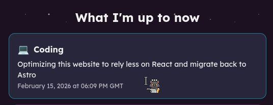
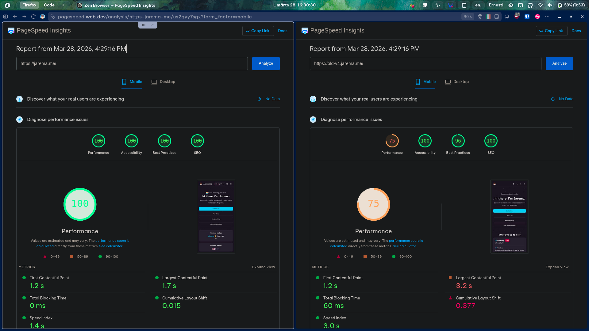
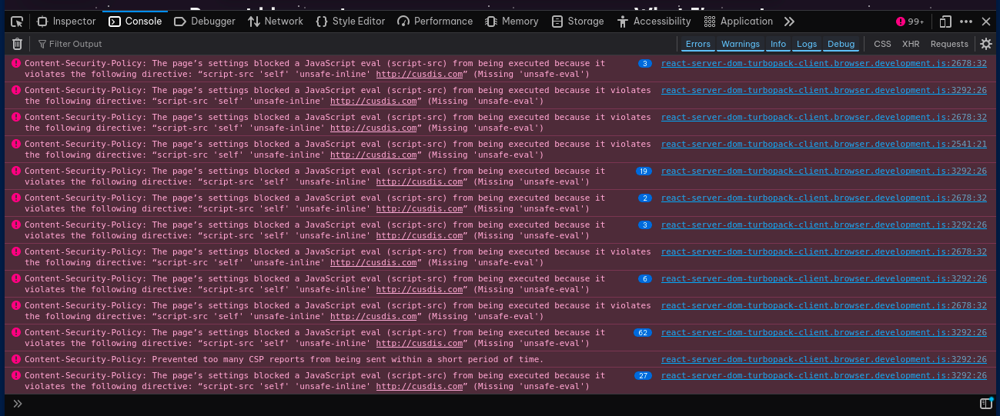
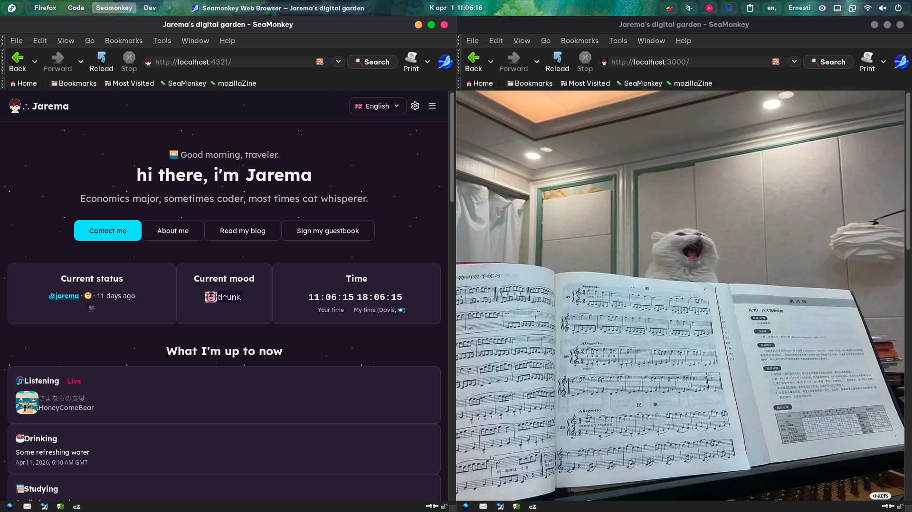

If you've been ~stalking~ ahem, following my site every now and then, perhaps you've gotten tired of seeing this now coding entry:

Welp... it's done, finally. [The site's back on Astro](https://github.com/jartf/website), and Next.js is gone. [I used Astro](https://github.com/jartf/website/tree/old-v3) before switching to Next.js, so this is sort of a homecoming. At some point I talked myself into migrating over, and I really can't remember what that reasoning was, but boy did I spend a good while fighting it. It's over now.

## The performance gap is embarrassing

The performance difference was the first thing that hit me when switching over. My Lighthouse scores on the Next.js version (eh, let's just call it "version 4", and we're calling the new Astro version "version 5") never reliably broke past 95 on performance, and that was even after I did a bunch of optimization. Okay yeah I was a bad coder back then, fair, but Next.js itself really didn't help either. On Astro, all four metrics are sitting at 100, and that's still with some React components left in the codebase via Astro's islands.

To be fair, Next.js is a good framework for building complex web applications. It's just that my personal site is most certainly not a complex web application. I was effectively using a pressure washer to water a tree here.

## The client/server split was driving me up the wall

Ohhhhh boy this one made my development experience *miserable*. I really don't want everything forced to render on the client. But because of Next.js's App Router, I ended up with two files in virtually every directory, one for the server and one with the `"use client"` flag for the client. Twice the files, twice the possibilities for things to go wrong.

Every time something broke, I had to move between both files trying to figure out which side was the cause. And I certainly didn't forget about the hook issues and hydration errors showing up in dev that didn't reproduce in production, nor the minified errors in production that absolutely refused to reproduce in dev.

The final straw was the browser console. I have a [fairly strict](https://securityheaders.com/?q=jarema.me&followRedirects=on) Content Security Policy on this site. I can do with `unsafe-inline`, but that's already enough and I don't want to add `unsafe-eval` on top of it even in dev. Next.js's dev server seems to hate it though, and boy it screams blood red constantly. If there's something I hate more than troubleshooting Next.js errors, it's this. You can only stare at that for so much before it starts getting personal.

With Astro, most of the page is just static, React runs only where I drop an island for it, and by now I'm too fed up with React to want it everywhere anyway. The console is quiet and it finally feels like home again.

## I didn't forget about the long build times and quirky browser compatibility either

A full build for version 4 on Vercel with Next.js was taking around a full minute, while on Astro it's down to 25–30 seconds. I added a built-in image resize and compression tool for funsies, and even with it the build time was only up by 15 seconds. That's already a huge difference, you can't imagine how annoying it is when I'm just pushing a typo fix and I have to wait for the whole thing to finish on v4.

More importantly: Next.js, particularly the App Router, is simply not compatible with older browsers. This wouldn't matter for a lot of sites, but I care about it specifically because I have a retro version of the site at [/retro](/retro) for people using older or more minimal browsers. Why make a retro version, you might ask? Well, the CSS on the main page for version 4 was just broken on SeaMonkey. It rendered weird and the background styles wouldn't even load at all. On version 5 it still displays slightly off (and this is a work in progress), but the CSS actually loads properly now. Look at this beauty boy:

I might not even need a retro page anymore since I can just adjust the styles on v5 now, but it's still nice to have nonetheless.

## I got a bonus out of this too: the site is lighter and greener

Less JavaScript to the browser also means less data transferred per visit. According to the Website Carbon Calculator, the old Next.js version produced [0.24 grams of CO₂ per page visit](https://www.websitecarbon.com/website/old-v4-jarema-me/). The new Astro version is down to [0.03 grams per page visit](https://www.websitecarbon.com/website/jarema-me/). That's an eighth of the environmental footprint. You can't even make this up bruh.

Oh and btw I can now call myself a member of the under-512KB club. On Next.js, the page transfer weight was 2.4MB *compressed* and the page was a whole [3.9MB uncompressed](https://radar.cloudflare.com/scan/584d91c5-77b3-4c3d-85f1-49b6eab82890/summary#statistics). Seriously!? Man, a dashboard could fit that whole 4MB, much less the homepage of a rando's personal site. Now on Astro, it's down to [506KB uncompressed](https://radar.cloudflare.com/scan/a4872010-eb18-4fcd-9448-b15b3df6d047/summary#statistics) and 299KB of transferred data. It's something I'm really proud of :D The goal is to push the codebase even further down from here of course.

## On Next.js's vendor lock-in

I'm still on Vercel for now, and maybe I'll stay for a while, as the deployment experience there is really convenient for a static site. But I don't want to be stuck there, and with how Next.js was back then I basically was. No, not because of Vercel's hosting itself, but because of Next.js's tight coupling with Vercel. Eduardo Boucas, an engineer at Netlify, wrote a [fairly detailed blog post](https://eduardoboucas.com/posts/2025-03-25-you-should-know-this-before-choosing-nextjs/) on this last year. Of course there's a conflict of interest, but the facts are evident enough, you should have a read at his article if you're interested in the topic. I'll just summarize the relevant point here.

Astro, Remix, SvelteKit, Nuxt, the likes, all have adapters for you to swap your deployment target freely (and fun fact, my own v5 site runs [dual adapters](https://github.com/jartf/website/blob/main/astro.config.mjs) for Vercel and Netlify depending on the environment). Meanwhile, Next.js had no official adapter system, and the build output was in a proprietary format designed around Vercel's infrastructure. Netlify and Cloudflare had to reverse-engineer their way in the internals and build on top of undocumented APIs, except the APIs themselves could and actually have broken between releases. It got so bad that Stormkit had to [drop support for Next.js](https://www.stormkit.io/blog/why-we-are-dropping-support-for-next-js) in 2023 because of the absolute nightmare to maintain. Yeah.

Sure, this isn't necessarily a reason to ditch Next.js entirely. Next.js 16.2 also finally has a proper Adapter API now. But the trust is broken and the overhead was too large for me to consider it again.

## So, back to the good old framework I loved

Yeah, everything above pretty much added up to the same conclusion that Next.js was not the right tool for this job. More complexity, more JavaScript, more page weight, slower builds, worse compatibility. Astro gives me a fast minimal baseline yet also has islands for the interactive parts, and it gives me a build output that I can point at wherever I want.

It took a *while* to finish the migration properly, but I'm glad I finished it. The scores speak for themselves, and honestly the codebase just feels cleaner to work in now. That's it for me.

Also, this is my third post of the [#100DaysToOffload](https://100daystooffload.com/) challenge.
